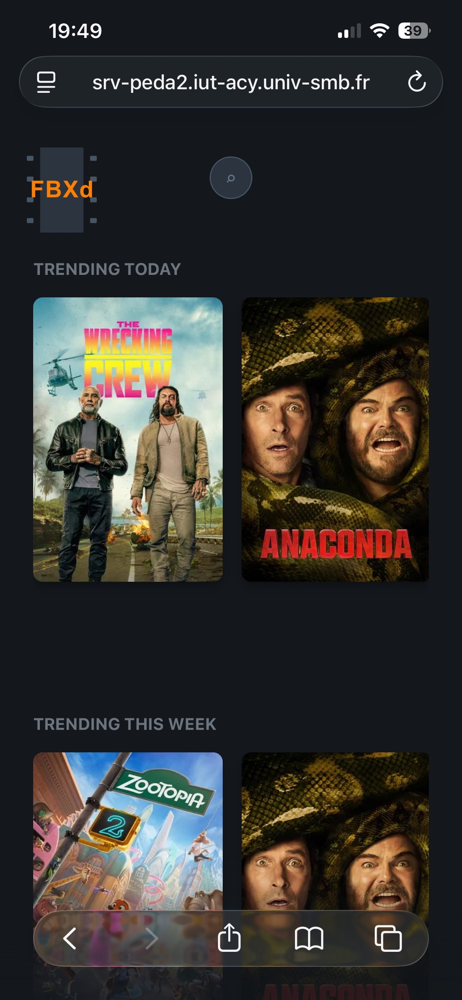
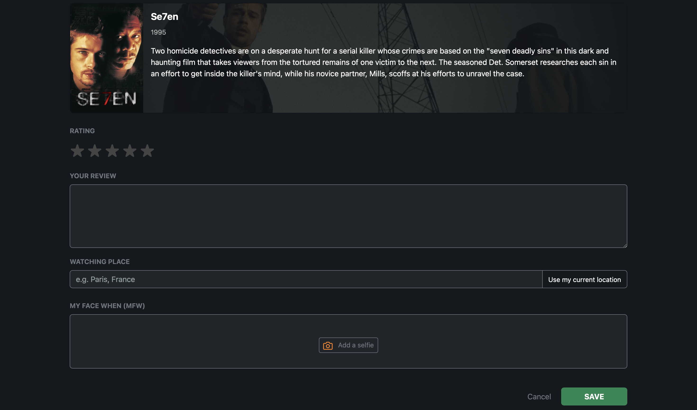
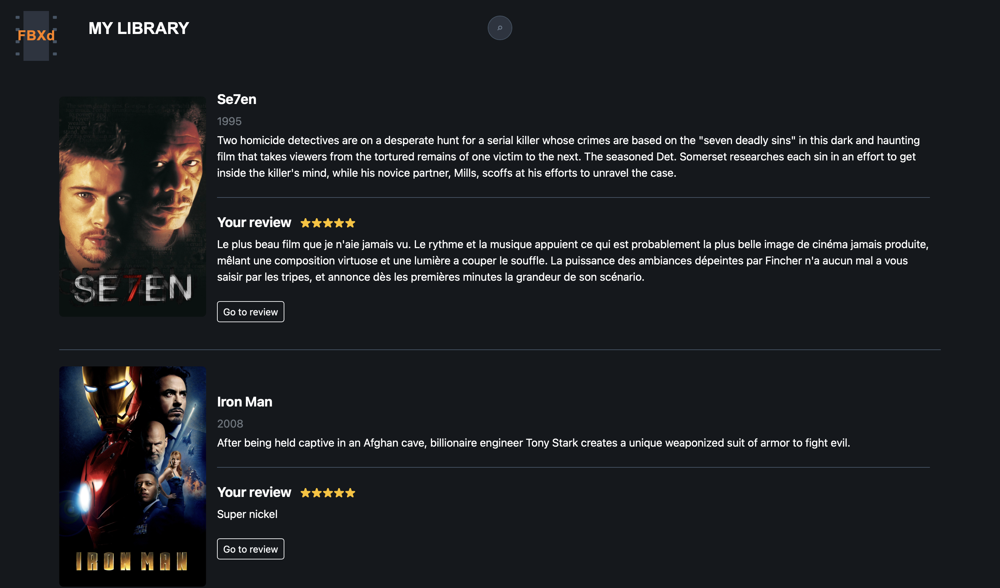
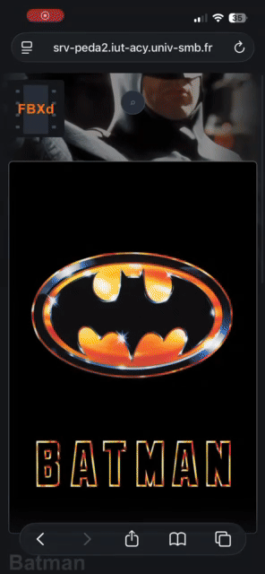
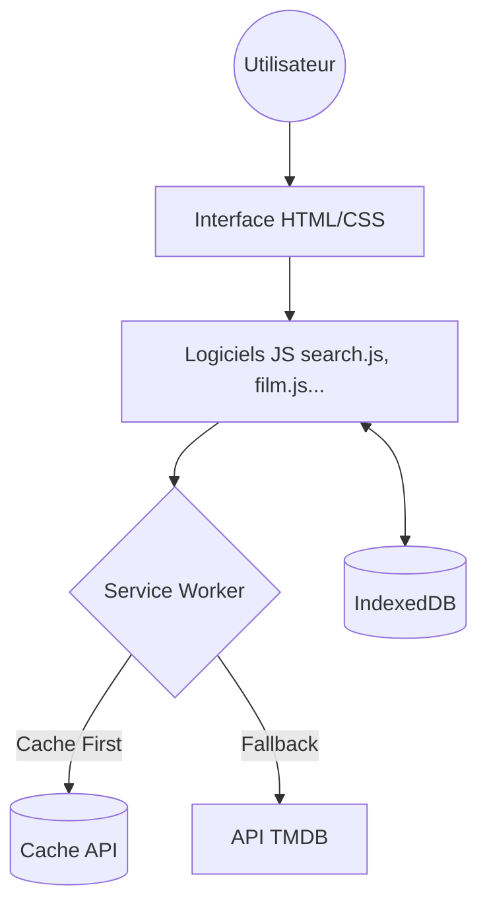

# FullBoxd 

FullBoxd est une **Progressive Web App (PWA)** moderne dédiée aux passionnés de cinéma. Elle permet de rechercher des films, de gérer une bibliothèque personnelle et d'écrire des critiques enrichies par des capteurs matériels (photo, géolocalisation).

##  Fonctionnalités

- **Recherche Instantanée** : Intégration complète avec l'API TMDB pour des résultats en temps réel.
- **Top Tendances** : Affichage des films populaires du jour et de la semaine.
- **Bibliothèque Personnelle** : Système de "Like" pour sauvegarder vos films préférés.
- **Critiques Enrichies** :
  - Notation par étoiles.
  - Localisation automatique ou manuelle du lieu de visionnage.
  - **MFW (My Face When)** : Capture optionelle d'un selfie "réaction" via la caméra pour illustrer votre critique.
- **Mode Hors-ligne (Offline)** : Consultation de la bibliothèque et des critiques même sans connexion internet.
- **Installation Native** : Installation sur écran d'accueil (Mobile/Desktop) avec gestion des mises à jour automatiques.

---

## 📸 Aperçu de l'Interface

### Version Ordinateur (Desktop)

#### Page d'accueil

#### Détails d'un film

#### Rédaction d'une critique

#### Bibliothèque

### Version Mobile (Smartphone)

| Page d'accueil | Détails d'un film | Rédaction d'une critique |
| :---: | :---: | :---: |
|  |  |  |

---

## 📖 Guide d'Utilisation

1.  **Rechercher** : Cliquez sur la loupe en haut pour ouvrir la barre de recherche. Tapez le nom d'un film pour voir les résultats en temps réel.
2.  **Enregistrer** : Sur la page d'un film, cliquez sur l'icône  pour l'ajouter à votre bibliothèque. Le film et ses images seront alors disponibles hors-ligne.
3.  **Critiquer** : Cliquez sur l'icône **Livre** pour ouvrir l'éditeur. Vous pouvez :
    *   Écrire votre passionnante critique.
    *   Attribuer une note (étoiles).
    *   Prendre un selfie "MFW" (My Face When) via votre caméra.
    *   Utiliser "Use my current location" pour localiser votre visionnage.
> Écrire une critique ajoute de facto le film a votre bibliothèque, ce qui le rend disponible hors-ligne.
5.  **Installer** : Sur mobile ou desktop, un popup vous proposera d'installer l'application. Si vous déclinez par inadvertance, un bouton "Install App" en bas de page vous permet d'installer l'application.

---

##  Composants Techniques

###  APIs Externes

1.  **TMDB (The Movie Database)** :
    *   Utilisée pour la recherche, les détails des films (backdrop, poster, synopsis) et les castings.
    *   Authentification via Token Bearer pour sécuriser les appels.
2.  **OpenStreetMap (Nominatim)** :
    *   Utilisée pour le **Reverse Geocoding**. Transforme les coordonnées GPS brutes en une adresse lisible (ex: "Paris, France") pour les reviews.

###  Gestion du Cache et Persistance

L'application utilise une stratégie hydride pour garantir une expérience fluide, même sans connexion.

#### 1. Pre-caching (Statique)
Dès l'installation, le **Service Worker** met en cache les fichiers essentiels (`RESOURCES` dans `service_worker.js`).
*   **But** : Lancement instantané de l'interface et fonctionnement hors-ligne des pages structurelles.

#### 2. Cache Dynamique (Images & Médias)
Les médias sont gérés dans des compartiments séparés :
*   **`images-cache`** : Stocke posters et backdrops. Ils sont ajoutés au cache dès qu'un utilisateur "Like" un film pour garantir que sa bibliothèque reste visuelle hors-ligne.
*   **`mfw-cache`** : Stocke les selfies de réaction (MFW) sous forme de Blobs associés à l'ID du film.

#### 3. Persistance des Données (IndexedDB)
Les données textuelles et relations sont stockées dans **IndexedDB** (`FullBoxdDB`) :
*   **Table `likes`** : Métadonnées complètes des films favoris.
*   **Table `reviews`** : Notes, textes et géolocalisation.

###  Capteurs & Matériel

*   **Geolocation API** : Récupération des coordonnées précises de l'utilisateur lors de la rédaction d'une critique.
*   **Media Capture / Camera** : Utilisation de l'attribut `capture="user"` sur les entrées de fichiers pour déclencher nativement la caméra selfie sur mobile.

---

##  Architecture 

### Architecture Logicielle

*   **Routage Physique** : L'utilisation de dossiers par page (ex: `/film/index.html`) permet d'avoir des "Pretty URLs" sans serveur de routage complexe.
*   **Séparation des Responsabilités** :
    *   `app.js` : Point d'entrée, installation PWA et Service Worker.
    *   `search.js` : Appels API TMDB et barre de recherche.
    *   `indexeddb.js` : Persistance locale.
*   **Clef d'API** : Isolée dans `config.js` et protégée par `.gitignore`.

### Flux de données

---

## Modèle de Données

### Objets TMDB (Films)
| Champ | Description |
| :--- | :--- |
| `id` | Identifiant unique du film |
| `title` | Titre du film |
| `release_date` | Date de sortie |
| `poster_path` | Chemin de l'affiche |

### Objets TMDB (Cast)
| Champ | Description |
| :--- | :--- |
| `name` | Nom de l'acteur |
| `character` | Rôle |

### IndexedDB
*   **Table `likes`** : `{ filmId (PK), filmData, addedAt }`
*   **Table `reviews`** : `{ filmId (PK), addedAt, review: { rating, text, location, mfw } }`

---

##  Fonctionnement PWA

1.  **Service Worker** : Intercepte les requêtes pour servir le cache en priorité (**Cache-First strategy**).
2.  **Mises à jour** : Détection automatique des changements de version et invitation au rechargement.
3.  **Manifeste** : Permet l'installation en "Standalone" sur l'écran d'accueil.

##  Roadmap & Évolutions

- [ ] **Fix CORS** : Pérennisation du workaround par proxy pour les conflits de politiques CORS.
- [ ] **Refactorisation du Code** : Refactorisation et optimisation du code pour des performances accrues et une serviçabilité maximale.
- [ ] **Mode Sombre Automatique** : Support du `prefers-color-scheme` pour un confort visuel accru.
- [ ] **Synchronisation DB** : Synchroniser les données utilisateur avec une base de données SQL. Cela permettrait à l'utilisateur de partager ses critiques et de voir les critiques de ses pairs.
- [ ] **Partage Social** : Partage direct des critiques sur Twitter/Threads avec l'image MFW.
- [ ] **Listes Personnalisées** : Permettre à l'utilisateur de créer ses propres collections (ex: "À voir", "Classiques").

---

##  Auteur

**Victor Fourny**
*Email : victor.fourny@etu.univ-smb.fr*

---
*Projet réalisé dans le cadre de la SAE 302 - Développement d'applications Web Avancées.*
