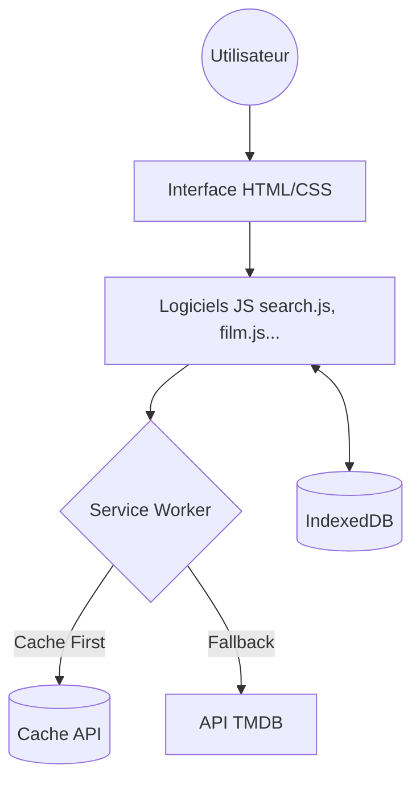

# FullBoxd 

FullBoxd est une **Progressive Web App (PWA)** moderne dédiée aux passionnés de cinéma. Elle permet de rechercher des films, de gérer une bibliothèque personnelle et d'écrire des critiques enrichies par des capteurs matériels (photo, géolocalisation).

##  Fonctionnalités

- **Recherche Instantanée** : Intégration complète avec l'API TMDB pour des résultats en temps réel.
- **Top Tendances** : Affichage des films populaires du jour et de la semaine.
- **Bibliothèque Personnelle** : Système de "Like" pour sauvegarder vos films préférés.
- **Critiques Enrichies** :
  - Notation par étoiles.
  - Géolocalisation automatique du lieu de visionnage.
  - **MFW (My Face When)** : Capture d'un selfie "réaction" via la caméra pour illustrer votre critique.
- **Mode Hors-ligne (Offline)** : Consultation de la bibliothèque et des critiques même sans connexion internet.
- **Installation Native** : Installation sur écran d'accueil (Mobile/Desktop) avec gestion des mises à jour automatiques.

---

##  Composants Techniques

###  APIs Externes

1.  **TMDB (The Movie Database)** :
    *   Utilisée pour la recherche, les détails des films (backdrop, poster, synopsis) et les castings.
    *   Authentification via Token Bearer pour sécuriser les appels.
2.  **OpenStreetMap (Nominatim)** :
    *   Utilisée pour le **Reverse Geocoding**. Transforme les coordonnées GPS brutes en une adresse lisible (ex: "Paris, France") pour les reviews.

###  Systèmes de Stockage

*   **IndexedDB** : Base de données locale intégrée au navigateur.
    *   Stockage des films likés (`likes`).
    *   Stockage des critiques textuelles et métadonnées (`reviews`).
    *   Permet un accès ultra-rapide et un support offline complet.
*   **Cache API (Service Worker)** :
    *   Mise en cache des ressources statiques (HTML, CSS, JS, icônes).
    *   Mise en cache dynamique des affiches de films pour la consultation hors-ligne.
    *   Gestion fine des versions pour forcer la mise à jour de l'application.

###  Capteurs & Matériel

*   **Geolocation API** : Récupération des coordonnées précises de l'utilisateur lors de la rédaction d'une critique.
*   **Media Capture / Camera** : Utilisation de l'attribut `capture="user"` sur les entrées de fichiers pour déclencher nativement la caméra selfie sur mobile, permettant la fonctionnalité "My Face When".

---

##  Architecture 

### Architecture Logicielle

*   **Routage Physique** : L'utilisation de dossiers par page (ex: `/film/index.html`) permet d'avoir des "Pretty URLs" (ex: `site.com/film/?id=...`) sans avoir besoin d'un serveur de routage complexe.
*   **Dossier JavaScript** : Tout le code javascript est centralisé dans le même dossier, et les liens sont relatifs pour garantir la portabilité.
*   **Clef d'API** : La clef TMDB est isolée dans `config.js` (ignoré par Git) pour sécuriser les credentials.
*   **Séparation des Responsabilités** :
    *   `app.js` : Point d'entrée, installation PWA et cycle de vie du Service Worker.
    *   `search.js` : Logique d'appel API et gestion globale de la barre de recherche.
    *   `indexeddb.js` : Couche d'abstraction pour les transactions de données locales.
*   **Cycle de Mise à jour** : Utilisation d'un système de versioning strict dans le Service Worker avec modal de rechargement forcé pour l'intégrité du cache.

### Flux de données

---

## Modèle de Données

Les données manipulées par l'application sont structurées selon les modèles suivants.

### Objets TMDB (Films)

Structure simplifiée des données récupérées depuis l'API TMDB et utilisées dans l'interface :

| Champ | Description |
| :--- | :--- |
| `id` | Identifiant unique du film |
| `title` | Titre du film |
| `original_title` | Titre original |
| `release_date` | Date de sortie |
| `overview` | Synopsis / Résumé |
| `poster_path` | Chemin de l'affiche (poster) |
| `backdrop_path` | Chemin de l'image de fond (cliché du film) |

### Stockage Local (IndexedDB)

#### Table `likes`
Stocke les films ajoutés à la bibliothèque.

| Propriété | Type | Description |
| :--- | :--- | :--- |
| `filmId` | Number (PK) | Identifiant unique (TMDB) |
| `filmData` | Object | Objet film complet (modèle TMDB) |
| `addedAt` | Date | Horodatage de l'ajout |

#### Table `reviews`
Stocke les critiques rédigées par l'utilisateur.

| Propriété | Type | Description |
| :--- | :--- | :--- |
| `filmId` | Number (PK) | Identifiant du film associé |
| `addedAt` | Date | Date de dernière modification |
| `review` | Object | Contenu de la critique (voir détail ci-après) |

**Détail de l'objet `review` :**

| Champ | Type | Description |
| :--- | :--- | :--- |
| `rating` | Number | Note sur 5 étoiles |
| `text` | String | Corps de la critique |
| `location` | String | Libellé géographique (ville, pays) |
| `mfw` | String | Référence à l'image selfie stockée en cache |

---

##  Fonctionnement PWA

L'application est conçue pour se comporter comme un logiciel natif :

1.  **Service Worker (`service_worker.js`)** :
    *   Intercepte les requêtes réseau (`fetch`).
    *   Priorise la récupération depuis le cache pour la performance.
    *   Gère la suppression des anciens caches lors du changement de version (`VERSION = "2.6"`).
2.  **Cycle de Vie & Mises à jour** :
    *   Détection automatique des nouvelles versions via `onupdatefound`.
    *   Affichage d'un modal de rechargement bloquant pour garantir que l'utilisateur utilise toujours la dernière version stable.
3.  **Manifeste** : Définit les icônes, les couleurs de thème et le comportement plein écran (`standalone`).

---

## 👤 Auteur

**Victor Fourny**
*Email : victor.fourny@etu.univ-smb.fr*

---
*Projet réalisé dans le cadre de la SAE 302 - Développement d'applications Web Avancées.*
